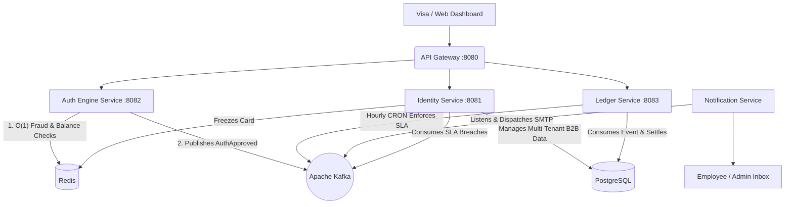

  <h1>💳 Boundless: Enterprise FinTech Platform</h1>
  
<em>A distributed, B2B Multi-Tenant Corporate Card & Expense Management Architecture.</em>

---

## 📖 Executive Overview
Boundless is a highly scalable, multi-tenant Microservices architecture modeled after industry leaders like Ramp, Brex, and Stripe Issuing. It demonstrates how to handle B2B client onboarding, strictly isolated tenant data, ultra-low latency transaction authorization, and automated compliance enforcement.

---

## 🌟 Enterprise Features (V2 Expansion)
*   **📡 Real-Time WebSockets:** Live streaming transaction dashboard pushed instantly from the backend to the browser.
*   **🌍 Multi-Currency Core:** Automatic cross-border conversion parsing live FX API rates with deterministic fallbacks.
*   **📜 Immutable Audit Trail:** Permanent, cryptographically secure logs of every monetary mutation and compliance action.
*   **🔔 B2B Event Webhooks:** Clients can register URL webhooks. The system asynchronously fires HTTP POST payloads signed with `HMAC-SHA256` for every transaction.
*   **📸 Smart Receipt OCR:** Integrates with Cloudinary and Gemini Vision API to automatically read uploaded receipt images and cross-match the extracted merchant/amount against the PostgreSQL ledger.
*   **🧠 AI Financial Intelligence:** Gemini 2.0 Flash is wired directly into the Ledger to enable natural-language querying of the database ("Who spent the most?") and automatic narrative generation ("Where Did The Money Go?" executive reports).

## 🏗 System Architecture

---

## 🏢 Platform Operations (The "Super Admins")
There is no single "God Mode". Boundless uses strict Segregation of Duties for its internal employees:
*   **Customer Success (`ROLE_PLATFORM_SUPPORT`)**: Read-only access to view client wallet balances and company status for troubleshooting.
*   **Risk & Compliance (`ROLE_PLATFORM_COMPLIANCE`)**: Can instantly freeze an entire client company (`FROZEN_FOR_AML_INVESTIGATION`) halting all transactions.
*   **Treasury (`ROLE_PLATFORM_TREASURY`)**: The only role authorized to wire money from the Federal Reserve into a client's Master Wallet.

---

## 🔄 The B2B Lifecycle (Flow of Funds)

### 1. KYB (Know Your Business) Onboarding
Prospective companies hit the public `POST /api/companies/register` endpoint.
1. The platform validates their Employer Identification Number (EIN).
2. Provisions a new `MasterWallet` in Postgres for the company.
3. Creates a `User` account for the Founder, automatically granting them the `ROLE_COMPANY_ADMIN` role.
4. Kafka instantly dispatches a welcome email with their generated temporary password.

### 2. Tenant Isolation & Self-Serve Administration
The Founder (`COMPANY_ADMIN`) logs in. **Row-Level Security** guarantees they can only view and mutate data belonging to their specific `companyName`.
1. **Onboard Employees:** The Founder invites employees. The system strictly links these employees to the Founder's company.
2. **Issue Budgets:** The Founder allocates a $1,000 travel budget. The platform checks the company's `MasterWallet` liquidity, subtracts $1,000, and provisions an Employee Wallet.
3. **Issue Virtual Cards:** The Founder issues a 16-digit Visa PAN. The system pushes this mapping (`card ➔ wallet`) directly into **Redis** for lightning-fast authorization routing.

### 3. The 200ms Transaction Swipe
When an employee swipes the card at an Apple Store, Visa hits the `Auth Engine Service` on Port 8082. The Auth Engine executes a strict **Chain of Responsibility**:
*   🚫 **MCC Blocking:** Instantly declines restricted Merchant Category Codes (e.g., Casinos).
*   ⏱️ **Velocity Tracking:** Declines cards swiped > 5 times in 24 hours.
*   🔒 **Brute-Force Protection:** Applies a 24-hour Redis lock after 3 failed CVV attempts.
*   💰 **Atomic Balances:** Verifies and deducts the $150 from the Employee's Virtual Wallet directly in Redis.
*   **Approval:** If all checks pass, it publishes an `AuthApprovedEvent` to Apache Kafka.

### 4. Asynchronous Settlement & Compliance
1. **The Ledger:** The Ledger Service consumes the Kafka event and permanently writes the transaction to PostgreSQL.
2. **Missing Receipt SLA:** If the swipe was over $50.00, it drops a "Receipt Reminder" event into Kafka, and the Notification Service emails the employee.
3. **The Enforcer:** An hourly Cron Job in the Ledger queries PostgreSQL for transactions > 24 hours old with no receipt. If found, it drops a `card-freeze-topic` event into Kafka.
4. **Automated Penalty:** The Identity Service consumes the freeze event, locks the virtual card in Postgres, and flushes it from Redis, guaranteeing the employee cannot spend another dime until they upload the receipt.
