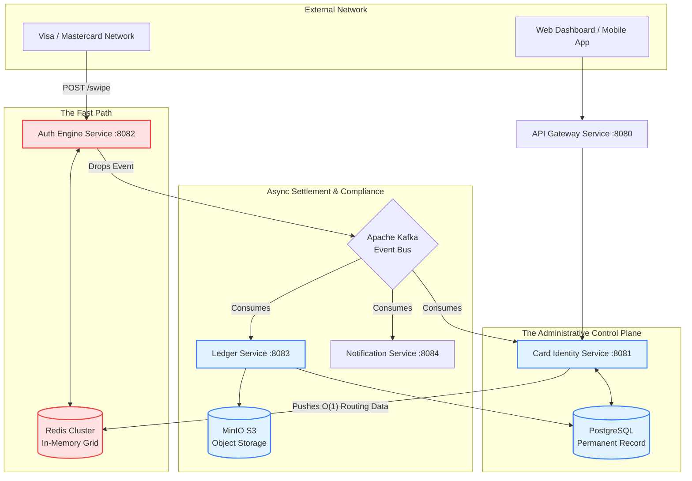
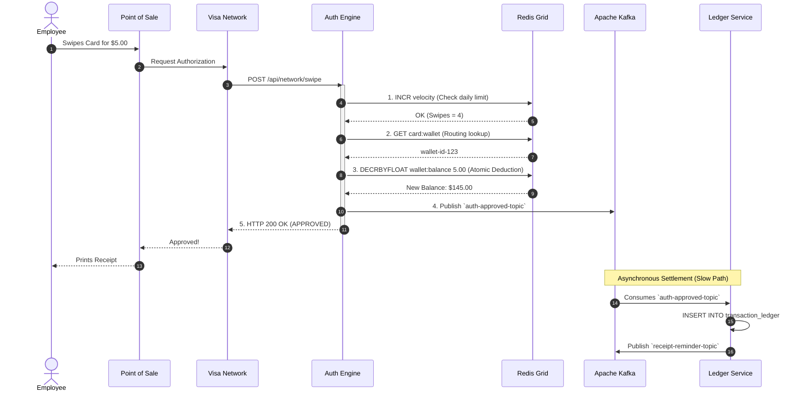
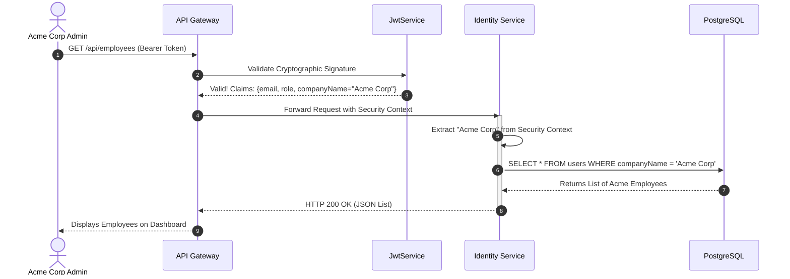

# Boundless FinTech Platform: The Definitive Master Architecture Guide

Welcome to the exhaustive, minute-by-minute architectural masterclass for the Boundless FinTech Platform. This document leaves no stone unturned. It covers every edge case, every database relation, every Kafka topic, and every sub-200ms optimization required to run a massive B2B Corporate Spend Management system.

---

## CHAPTER 1: The Business Model & Domain Entities

Boundless is not a consumer bank. It is a **Business-to-Business (B2B) Spend Management Platform**. Our clients are startup founders and corporate treasurers (e.g., Acme Corp) who need to issue corporate credit cards to their employees for software subscriptions, travel, and expenses.

To support this, the database is strictly modeled around corporate hierarchies:

### 1.1 The Company Entity
Before anyone can use the platform, the legal entity must be verified via KYB (Know Your Business).
*   **Attributes**: `companyName`, `einNumber` (Employer Identification Number), and `kybStatus` (PENDING, APPROVED, FROZEN).
*   **The Freeze Mechanism**: If the Risk & Compliance team detects money laundering, they flip the company's `kybStatus` to FROZEN. This instantly cascades, freezing every Master Wallet, every Employee Wallet, and every Virtual Card associated with that Tenant.

### 1.2 The Master Wallet
This is the lifeblood of the tenant. Boundless does not extend credit. We are a pre-paid platform.
*   **The Flow**: Acme Corp wires $100,000 of real USD from their Chase Bank account to Boundless's master treasury account.
*   **The Minting**: The Boundless `ROLE_PLATFORM_TREASURY` officer intercepts that wire, logs into the Internal Ops portal, and mints $100,000 of digital liquidity into Acme Corp's `MasterWallet`.
*   **Constraint**: The `MasterWallet` is a singular pool. Employees cannot swipe directly against it.

### 1.3 The Employee Wallet
To allow an employee to spend money, the Company Admin must carve out a specific budget.
*   **The Allocation**: If a founder wants to give an employee a $500 travel budget, the system atomically deducts $500 from the `MasterWallet` and moves it into the Employee's `Wallet`.
*   **Isolation**: An employee can have multiple wallets (e.g., "Software Subscriptions", "Travel", "Per Diems"), each with its own isolated balance.

### 1.4 The Virtual Card (The PAN)
The virtual card is the 16-digit Primary Account Number (PAN) that the employee actually types into Amazon or hands to a barista.
*   **The Binding**: Every card is strictly bound to exactly one `Wallet` (Foreign Key: `wallet_id`).
*   **Card Types**: Cards can be `STANDARD` (multi-use, recurring) or `BURNER` (single-use, auto-destructing).

---

## CHAPTER 2: Multi-Tenancy & Row-Level Security

Because Boundless hosts multiple competitor companies (Acme Corp and Globex) in the exact same PostgreSQL database, data leakage is catastrophic. We prevent this using strict Row-Level Security (RLS) enforced at the application layer.

### 2.1 The Identity Binding
Every `User` in the database has a `companyName` column. This is the tenant identifier.
When a user logs in, the `JwtService` embeds their `companyName` inside the cryptographically signed JWT payload.

### 2.2 Endpoint Isolation
When the Acme Corp Admin hits the `GET /api/company-admin/employees` endpoint, the `CompanyAdminController` extracts the `companyName` directly from the JWT Context. 
It executes: `SELECT * FROM users WHERE companyName = 'Acme Corp'`.
It is mathematically impossible for the Acme Admin to query or view employees belonging to Globex, because the `WHERE` clause is hardcoded to their authenticated JWT identity.

### 2.3 Financial Isolation
When the Acme Corp Admin tries to issue a card to an employee `UUID`:
1. The controller looks up the target Employee.
2. It compares `Employee.companyName` against `Admin.companyName`.
3. If they do not match exactly, the system throws a `SecurityException: Cannot fund an employee outside your company!` and drops a proactive alert to the internal security team.

---

## CHAPTER 3: The Internal Ops Triad

To prevent massive internal fraud, Boundless fractures platform administration into three distinct teams. No single employee has "God Mode".

### 3.1 The Treasury Team (`ROLE_PLATFORM_TREASURY`)
*   **Mandate**: Liquidity Management.
*   **Power**: They are the only team with access to `POST /api/internal-ops/master-wallet/fund`. They bridge the gap between the real banking world and the digital database.
*   **Alerts**: If a founder tries to allocate budget to an employee but the Master Wallet is empty, the Treasury team receives an automated Kafka alert to proactively email the founder asking for a wire transfer.

### 3.2 Risk & Compliance (`ROLE_PLATFORM_COMPLIANCE`)
*   **Mandate**: Anti-Money Laundering (AML) & Fraud Prevention.
*   **Power**: They have the ability to hit `/api/internal-ops/companies/{name}/freeze`.
*   **Alerts**: If the Auth Engine detects a Brute Force CVV attack, or an employee trying to swipe at an illegal casino, it drops an alert. The Compliance team is notified instantly and can lock down the tenant.

### 3.3 Customer Success (`ROLE_PLATFORM_SUPPORT`)
*   **Mandate**: Client Retention & Troubleshooting.
*   **Power**: They have Read-Only access across the platform (`GET /overview`). They cannot move money or freeze accounts.
*   **Alerts**: If an employee is declined at Starbucks for "Insufficient Funds", Support gets the alert. When the employee calls to complain, Support already has the dashboard open and can explain that the founder hasn't allocated enough budget.

---

## CHAPTER 4: The Fast Path (The 200ms Auth Engine)

The `auth-engine-service` is the crown jewel of the platform. When a card is swiped at a terminal, Visa fires a webhook to `POST /api/network/swipe`. Visa requires a response in under 200 milliseconds. If the system takes 201ms, Visa drops the connection and declines the card.

To achieve this, the Auth Engine **completely ignores PostgreSQL**. Disk I/O is too slow. It relies entirely on a pre-warmed Redis In-Memory Data Grid.

### 4.1 The Redis Synchronization
When the Identity Service issues a card, it doesn't just save it to Postgres. It pushes critical O(1) routing data to Redis:
*   `SET card:{pan}:wallet {wallet_id}`
*   `SET wallet:{wallet_id}:balance 500.00`
*   `SET card:{pan}:type STANDARD`

### 4.2 The Chain of Responsibility Gauntlet
When the Visa webhook arrives, the `FraudEngine` class runs it through a gauntlet of Java rules. If any rule fails, the chain breaks and a 400 Bad Request is returned.

1.  **Velocity Rule**: The system calls `INCR velocity:{pan}:{YYYY-MM-DD}` in Redis. If the returned integer is > 10, the card has been swiped too many times today. Decline.
2.  **Merchant Category Code (MCC) Rule**: The system checks the `merchantName` string against a highly restricted regex blacklist. "Las Vegas Casino", "Local Dive Bar", and "Binance Crypto" trigger an instant decline and a Kafka alert to Compliance.
3.  **Brute Force Rule**: If the CVV provided by Visa doesn't match, `INCR cvv_failures:{pan}` is called. If the hacker hits 3 failures, the card is locked for 24 hours. Decline.
4.  **The Balance Rule (The Core Logic)**:
    *   The system looks up the wallet: `GET card:{pan}:wallet`.
    *   It executes an atomic `DECRBYFLOAT wallet:{wallet_id}:balance {amount}`.
    *   If the resulting balance is negative (e.g., -5.00), it immediately reverses it (`INCRBYFLOAT`) and throws an Insufficient Funds exception.
    *   If positive, the transaction is approved!

### 4.3 The Single-Use Burner Sequence
If the card passes the gauntlet, the Auth Engine checks `GET card:{pan}:type`.
If the string equals `BURNER`, the Auth Engine executes a self-destruct.
It calls `DEL card:{pan}:wallet` and `DEL card:{pan}:status`.
The card ceases to exist in the Fast Path memory. If a hacker steals the number and tries to use it 5 seconds later, the Auth Engine will return "Card Not Found".

---

## CHAPTER 5: The Slow Path (Ledger & SLA Compliance)

Because the Auth Engine has no time to write to PostgreSQL or enforce corporate receipt policies, it relies on Event-Driven Architecture.
When the Auth Engine approves a swipe, it publishes an `auth-approved-topic` string to Apache Kafka and returns 200 OK to Visa. Its job is done.

### 5.1 Asynchronous Settlement
The `ledger-service` listens to `auth-approved-topic`. When it consumes the event, it parses the JSON and executes a heavy `INSERT INTO transaction_ledger` SQL statement. This permanently records the financial history for tax auditors.

### 5.2 The RBI OTP Mandate
If the swipe amount is massive (e.g., > ₹5,000), the Reserve Bank of India (RBI) requires 2-Factor Authentication.
*   The Auth Engine halts the transaction, returning `202 PENDING_OTP` to Visa.
*   It generates a 6-digit code, saves `SET otp:{pan} 123456 EX 300` in Redis.
*   It drops an `otp-email-topic` Kafka event.
*   The Notification service emails the code to the employee's phone.
*   The transaction is frozen in mid-air until the employee proves their identity.

### 5.3 The 24-Hour Receipt SLA (The Enforcer)
Corporate tax law requires physical receipts for large purchases. Boundless automates this entirely.
1.  **The Warning**: The moment a $50+ transaction settles, the Ledger Service drops a `receipt-reminder-topic` event. The employee immediately gets an email: "Please upload your receipt within 24 hours."
2.  **The Cron Job**: Inside the Ledger Service is a Spring `@Scheduled` method running every 5 minutes.
    *   It queries: `SELECT * FROM transaction_ledger WHERE amount > 50 AND receiptUploaded = false AND created_at < (NOW - 24 HOURS)`.
    *   If it finds a guilty transaction, it drops a `card-freeze-topic` event to Kafka.
3.  **The Freeze**: The Identity Service consumes the freeze event. It executes `SET card:{pan}:status FROZEN` in Redis. 
    *   Result: The employee is stranded at a restaurant and their card is declined until they do their expense reports!

### 5.4 S3 Object Storage Unfreezing
To unlock their card, the employee must upload an image.
1.  They hit `POST /api/transactions/{id}/receipt` with a Multipart File.
2.  The Ledger Service connects to **MinIO (AWS S3 Compatible Storage)** and streams the image bytes into the `boundless-receipts` bucket.
3.  It saves the public `s3Url` in Postgres and sets `receiptUploaded = true`.
4.  It fires a `card-unfreeze-topic` Kafka event.
5.  The Identity Service hears it and calls `DEL card:{pan}:status` in Redis. The card is instantly active again!

---

## CHAPTER 6: Kafka Topic Dictionary & Data Payloads

The entire nervous system of the 5 microservices relies on these precise Kafka payloads:

1.  **`auth-approved-topic`**: `{"cardNumber":"4111...", "merchantName":"Starbucks", "amount":"4.50"}`
    *   *Producer*: Auth Engine | *Consumer*: Ledger
2.  **`employee-onboarding-topic`**: `{"email":"john@acme.com", "employeeId":"EMP-123", "tempPassword":"..."}`
    *   *Producer*: Identity | *Consumer*: Notification
3.  **`otp-email-topic`**: `{"cardNumber":"4111...", "otp":"123456"}`
    *   *Producer*: Auth Engine | *Consumer*: Notification
4.  **`receipt-reminder-topic`**: `{"cardNumber":"4111...", "merchantName":"Delta Airlines", "amount":"450.00"}`
    *   *Producer*: Ledger | *Consumer*: Notification
5.  **`card-freeze-topic`**: `{"cardNumber":"4111...", "reason":"Missed 24-hour receipt SLA"}`
    *   *Producer*: Ledger (Cron) | *Consumer*: Identity
6.  **`card-unfreeze-topic`**: `"4111..."` (Just the string PAN)
    *   *Producer*: Ledger (S3 Upload) | *Consumer*: Identity
7.  **`card-closed-topic`**: `"4111..."` (Just the string PAN)
    *   *Producer*: Auth Engine (Burner sequence) | *Consumer*: Identity
8.  **`internal-alert-topic`**: `{"role":"ROLE_PLATFORM_COMPLIANCE", "targetEmail":"compliance@boundless.com", "alert":"SECURITY INCIDENT: Swipe declined for Binance Crypto."}`
    *   *Producer*: Auth/Identity | *Consumer*: Notification

---

## CHAPTER 7: Architecture Diagrams & Data Flow Control

To truly understand how Boundless prevents data leakage and hits sub-200ms speeds, we must map the control flow and data flow visually.

### 7.1 Global System Architecture
This diagram illustrates the macro-level boundaries. Notice how the Fast Path (Red) is completely isolated from the Slow Path (Blue).

### 7.2 The 200ms Transaction Sequence (Data Flow)
When an employee swipes their card, the data flow is strictly controlled to ensure atomic deductions and absolute speed. Notice how the Ledger is completely bypassed during the critical path.

### 7.3 Multi-Tenancy Control Flow (Row-Level Security)
How does the system mathematically guarantee that a Manager at Acme Corp cannot view an Employee at Globex? 

